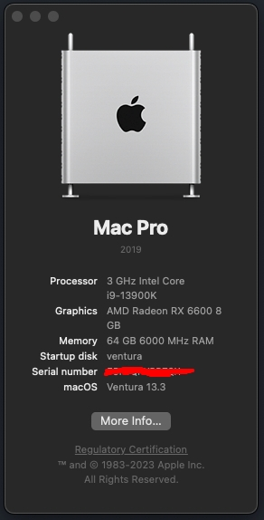
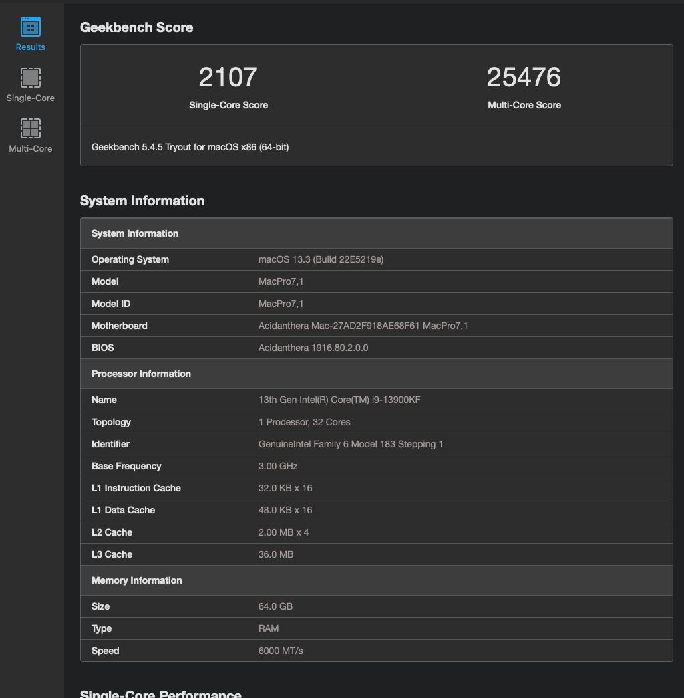
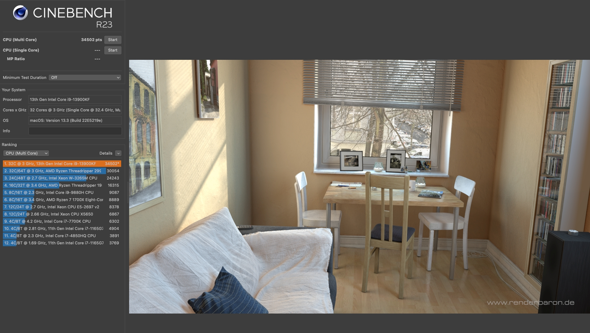

# Hackintosh-MSI-Z790-Pro-Carbon-13900KF-6600-OpenCore
### Hardware
```
CPU : 13900KF
GPU : RX 6600
M/B : MPG Z790 CARBON WIFI
RAM : 4X16GB DDR5 6000 
```
### Add on
```
WIFI/BT : Fenvi FV-T919 1750Mbps
Audio : UGREEN USB Sound Card 30724
```
### OS

##### GeekBench 5

##### CINEBENCH R23


